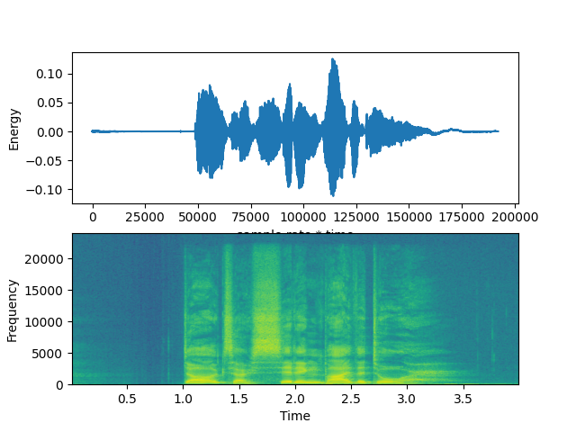
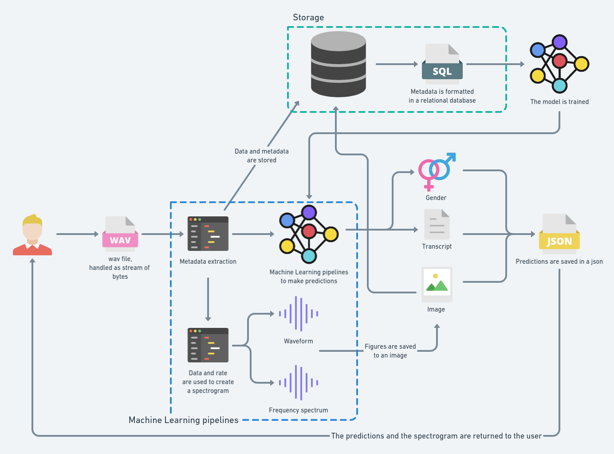

# Voice analysis endpoint

FastAPI based endpoint which loads a .wav file as input and returns a response.

## Example response
```
{
  "success": true,
  "audio analysis": {
    "gender": "male",
    "confidence": 0.9590235948562622
  },
  "text analysis": {
    "transcript": [
      "no that's not gonna do it"
    ],
    "confidence": [
      0.92713708
    ],
    "less_probable_transcripts": [
      "no that's not going to do it"
    ],
    "sentiment": {
      "label": "NEGATIVE",
      "score": 0.9987033605575562
    }
  }
}
```




## License

[MIT](https://choosealicense.com/licenses/mit/)

  
## Current overview of the project (Likely to change)

